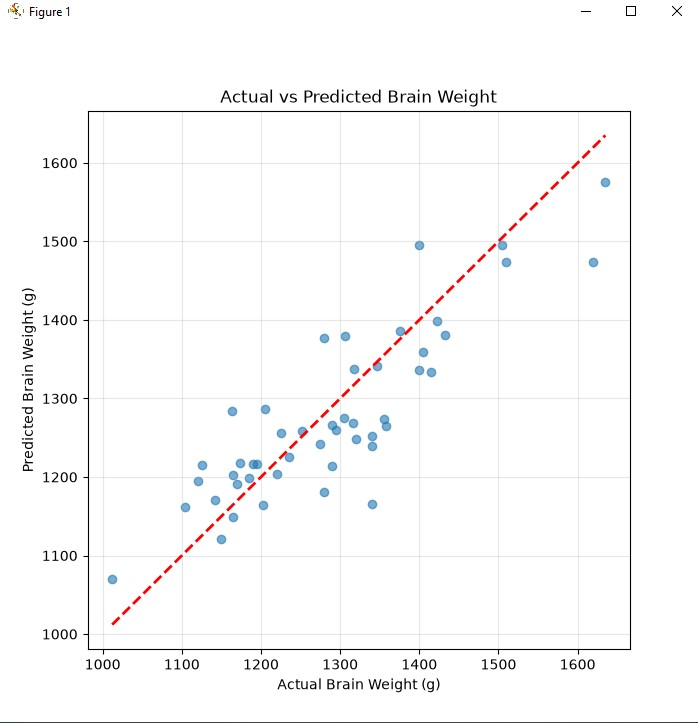
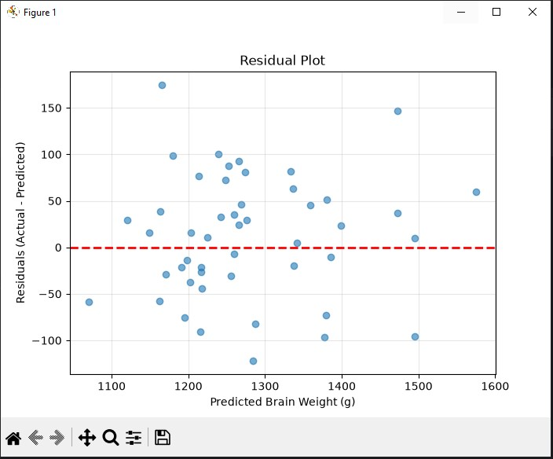
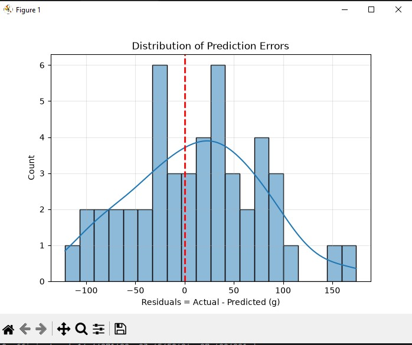

# Brain Weight Prediction using Linear Regression

A machine learning project that predicts human **brain weight (grams)** from **head size (cm³)** and demographic features (**gender**, **age range**) using a **Linear Regression** model built with scikit-learn.

---

## Table of Contents

1. [Dataset Overview](#dataset-overview)
2. [Project Workflow](#project-workflow)
3. [Feature Engineering: Encoding & Scaling](#feature-engineering-encoding--scaling)
4. [Model: Linear Regression Pipeline](#model-linear-regression-pipeline)
5. [Evaluation Metrics](#evaluation-metrics)
6. [Visualizations & Explanation](#visualizations--explanation)
7. [Limitations](#limitations)
8. [Conclusion](#conclusion)
9. [Future Work](#future-work)
10. [How to Run](#how-to-run)

---

## Dataset Overview

The dataset (`headbrain.csv`) is the classic **Head Size and Brain Weight** dataset, containing **237 records** with 4 columns:

| Column | Description | Type |
|---|---|---|
| `Gender` | 1 = Male, 2 = Female | Categorical |
| `Age Range` | 1 = 20–46 years, 2 = 46+ years | Categorical |
| `Head Size(cm^3)` | Volume of the head in cubic centimeters | Numeric |
| `Brain Weight(grams)` | Target variable — brain weight in grams | Numeric |

### Sample Rows

| Gender | Age Range | Head Size(cm³) | Brain Weight(g) |
|---:|---:|---:|---:|
| 1 | 1 | 4512 | 1530 |
| 1 | 1 | 3738 | 1297 |
| 1 | 1 | 4261 | 1335 |
| 1 | 1 | 3777 | 1282 |
| 1 | 1 | 4177 | 1590 |
| 1 | 1 | 3585 | 1300 |
| 1 | 1 | 3785 | 1400 |
| 1 | 1 | 3559 | 1255 |

### Statistical Summary

| Stat | Gender | Age Range | Head Size(cm³) | Brain Weight(g) |
|---|---:|---:|---:|---:|
| count | 237 | 237 | 237 | 237 |
| mean | 1.43 | 1.54 | 3633.99 | 1282.87 |
| std | 0.50 | 0.50 | 365.26 | 120.34 |
| min | 1 | 1 | 2720 | 955 |
| 25% | 1 | 1 | 3389 | 1207 |
| 50% | 1 | 2 | 3614 | 1280 |
| 75% | 2 | 2 | 3876 | 1350 |
| max | 2 | 2 | 4747 | 1635 |

### Class Balance

- **Gender**: 134 Male, 103 Female — reasonably balanced
- **Age Range**: 110 in group 1 (20–46 yrs), 127 in group 2 (46+ yrs) — reasonably balanced

No missing values are present in this dataset, so no imputation step was required.

---

## Project Workflow

The end-to-end pipeline follows these steps:

```
Raw CSV
   │
   ▼
Train/Test Split (80/20)
   │
   ▼
Preprocessing
   ├── One-Hot Encode categorical features (Gender, Age Range)
   └── Standard Scale numeric feature (Head Size)
   │
   ▼
Linear Regression Model Training
   │
   ▼
Prediction on Test Set
   │
   ▼
Evaluation (R², MAE, RMSE) + Residual Diagnostics
```

---

## Feature Engineering: Encoding & Scaling

### Why Encoding is Needed

`Gender` and `Age Range` are stored as integers (`1`/`2`) in the raw CSV, but these numbers are **labels, not quantities** — `2` is not "twice" the value of `1`. If fed directly into Linear Regression, the model would wrongly assume an ordered numeric relationship between categories.

**Solution: One-Hot Encoding**

```python
OneHotEncoder(drop='first')
```

This converts each category into a binary (0/1) column, and `drop='first'` removes one column per feature to avoid the **dummy variable trap** (perfect multicollinearity between dummy columns). After encoding, the features become:

```
['cat__Gender_2', 'cat__Age Range_2', 'num__Head Size(cm^3)']
```

Only `Gender_2` (Female) and `Age Range_2` (46+ yrs) remain — each acts as a flag against the dropped baseline category (`Gender_1`, `Age Range_1`).

### Why Scaling is Needed

`Head Size(cm^3)` ranges from ~2720 to ~4747 — a much larger numeric scale than the 0/1 encoded categorical columns. Although **Linear Regression itself doesn't strictly require feature scaling** for correctness (coefficients adjust automatically), scaling is still good practice here because:

- It keeps coefficient magnitudes interpretable and comparable across features
- It future-proofs the pipeline for swapping in regularized models (Ridge, Lasso) or gradient-based learners later, which **do** require scaling
- It improves numerical stability

**Solution: Standard Scaling**

```python
StandardScaler()
```

This transforms `Head Size` to have **mean = 0** and **standard deviation = 1**, using the formula:

```
z = (x - mean) / std
```

### Combining Both with `ColumnTransformer`

```python
ColumnTransformer(transformers=[
    ('cat', OneHotEncoder(drop='first'), cat_features),
    ('num', StandardScaler(), num_features)
])
```

`ColumnTransformer` applies different preprocessing to different columns **in a single object**, ensuring categorical and numeric features are transformed correctly and consistently — both during training and on new/unseen data.

---

## Model: Linear Regression Pipeline

```python
pipe = make_pipeline(preprocessor, LinearRegression())
pipe.fit(X_train, y_train)
```

`make_pipeline` chains the `ColumnTransformer` and `LinearRegression` into a single object. This is a best practice because:

- **No data leakage**: scaling/encoding statistics are learned only from `X_train`, never from `X_test`
- **Reusability**: the entire preprocessing + model logic can be saved, loaded, and reused with one object (e.g., via `joblib`)
- **Cleaner code**: one `.fit()` and one `.predict()` call instead of manually managing transformed arrays

### Learned Coefficients

```
Features: ['cat__Gender_2', 'cat__Age Range_2', 'num__Head Size(cm^3)']
Coefficients: [-14.45, -23.65, 87.62]
```

| Feature | Coefficient | Interpretation |
|---|---:|---|
| `Gender_2` (Female) | -14.45 | Holding other features constant, being female is associated with ~14.45g lower predicted brain weight than the baseline (male) |
| `Age Range_2` (46+ yrs) | -23.65 | Being in the older age group is associated with ~23.65g lower predicted brain weight than the baseline (20–46 yrs) |
| `Head Size` (scaled) | +87.62 | The strongest predictor — for each 1 standard deviation increase in head size, predicted brain weight increases by ~87.62g |

**Key insight:** Head size dominates the prediction by a wide margin compared to gender or age — consistent with biological expectations.

---

## Evaluation Metrics

| Metric | Value | Meaning |
|---|---:|---|
| **R²** | 0.7346 | The model explains ~73.5% of the variance in brain weight |
| **MAE** | 54.09g | On average, predictions are off by ~54g |
| **RMSE** | 65.95g | Penalizes larger errors more — being higher than MAE confirms a few larger misses exist |
| **Mean Residual** | 11.91g | Small positive bias — the model slightly *underpredicts* on average |
| **Std of Residuals** | 65.56g | Closely matches RMSE, confirming consistent error spread with no major calculation discrepancy |

---

## Visualizations & Explanation

### 1. Actual vs Predicted Brain Weight



This scatter plot compares actual brain weight (x-axis) against model-predicted brain weight (y-axis). The **red dashed line** represents perfect prediction (where actual = predicted).

**Explanation:** Most points cluster reasonably close to the red line, especially in the 1100–1400g range, confirming the model captures the general trend well. However, spread **widens at the extremes** (below 1100g and above 1400g) — indicating the model is **less reliable for unusually small or large brain weights**. This pattern is known as **heteroscedasticity** (non-constant error variance).

### 2. Residual Plot



This plot shows residuals (Actual − Predicted) against predicted values. The **red dashed line at y=0** represents zero error.

**Explanation:** Residuals are scattered fairly randomly around zero with no strong funnel or curved pattern, which is a good sign — it suggests the linear model is a reasonable fit and isn't systematically biased in one direction across the prediction range. A few notable outliers exist: one large positive residual (~+175g near predicted 1170g) and a few negative residuals around -100g, representing cases the model struggles with most.

### 3. Distribution of Prediction Errors (Residual Histogram)



This histogram shows the distribution of residuals with a KDE (smooth density curve) overlaid. The **red dashed line at x=0** marks zero error.

**Explanation:** The distribution is roughly bell-shaped and centered slightly to the right of zero (matching the +11.91g mean residual bias noted above), which is a reasonably healthy sign for a linear model. However, there are a couple of residuals stretching out to +150–175g, visible as isolated bars on the right tail — these correspond to the same outlier points seen in the residual plot, and pull the distribution away from a perfectly normal shape.

---

## Limitations

1. **Single numeric predictor**: Head size is the only continuous feature. Brain weight is influenced by many other biological factors (age in exact years, height, overall body mass, genetics, health conditions) that aren't captured here.
2. **Coarse categorical bucketing**: `Age Range` only has two buckets (20–46 vs 46+), losing significant resolution. A 25-year-old and a 45-year-old are treated identically.
3. **Linear assumption**: Linear Regression assumes a strictly linear relationship between features and target. Biological growth/decline patterns (e.g., brain weight changes with aging) may follow non-linear curves not captured here.
4. **Heteroscedasticity**: As seen in the Actual vs Predicted plot, error variance is not constant across the range — the model is demonstrably less accurate for extreme head sizes.
5. **Small dataset**: With only 237 rows (and ~48 in the test set), results may not generalize well to broader or different populations (e.g., different ethnic groups, countries, or age distributions not represented here).
6. **No outlier treatment**: A handful of residual outliers exist but were not investigated or removed — they may represent genuine biological variation or data quality issues.
7. **No cross-validation**: Results come from a single train/test split (`random_state=42`). Performance may vary with a different split; k-fold cross-validation would give a more robust estimate.
8. **Moderate R² (0.73)**: A meaningful chunk (~27%) of brain weight variance remains unexplained by the current features.

---

## Conclusion

This project successfully demonstrates a complete, professionally structured Linear Regression workflow: proper categorical encoding (avoiding the dummy variable trap), numeric feature scaling, pipeline-based training to prevent data leakage, and thorough residual diagnostics rather than relying on a single metric.

The model achieves an **R² of 0.73**, **MAE of ~54g**, and **RMSE of ~66g**, confirming that **head size is a strong and dominant predictor of brain weight**, while gender and age contribute smaller, secondary adjustments. The residual analysis shows the model is generally well-behaved (no major bias or systematic pattern), though it loses accuracy at the extremes of the head-size distribution — a known limitation of simple linear models on biological data with natural variability.

Overall, this is a solid, interpretable baseline model — appropriate as a first regression project, and a good foundation to build upon with more advanced techniques.

---

## Future Work

To improve metrics and robustness, the following enhancements are recommended:

1. **Add more features**: Incorporate height, weight, exact age (instead of age range), or genetic/ethnicity data if available, to capture more variance.
2. **Try non-linear models**: Random Forest Regressor, Gradient Boosting (XGBoost/LightGBM), or polynomial regression to capture potential non-linear relationships between head size and brain weight.
3. **Cross-validation**: Replace the single train/test split with **k-fold cross-validation** to get a more reliable, less split-dependent performance estimate.
4. **Outlier investigation**: Examine the specific records causing the largest residuals (~+175g, ~-100g) to determine if they're genuine biological variation or data entry errors.
5. **Regularization**: Experiment with **Ridge** or **Lasso** regression to reduce overfitting risk and improve generalization, especially if more features are added.
6. **Interaction terms**: Test interaction effects, e.g., `Head Size × Gender`, since brain weight scaling with head size may differ between genders.
7. **Finer age granularity**: If available, use exact age instead of a binary age range to capture more nuanced age-related effects.
8. **Larger dataset**: Collect or source a larger, more diverse dataset to improve generalizability and reduce variance in the R²/MAE/RMSE estimates.
9. **Hyperparameter tuning**: For any future non-linear model, use `GridSearchCV` or `RandomizedSearchCV` to systematically tune hyperparameters.
10. **Model comparison report**: Build a comparison table benchmarking Linear Regression against 2–3 alternative models on the same train/test split for a complete evaluation.

---

## How to Run

1. Place `headbrain.csv` in the same directory as the script.
2. Install dependencies:
   ```bash
   pip install pandas matplotlib seaborn scikit-learn
   ```
3. Run the script:
   ```bash
   python brain_weight_prediction.py
   ```
4. The script will print evaluation metrics to the console and display three diagnostic plots (Actual vs Predicted, Residual Plot, Residual Histogram).

---

**Author's Note:** This is a learning project built while studying Machine Learning fundamentals — feedback and suggestions are welcome.
